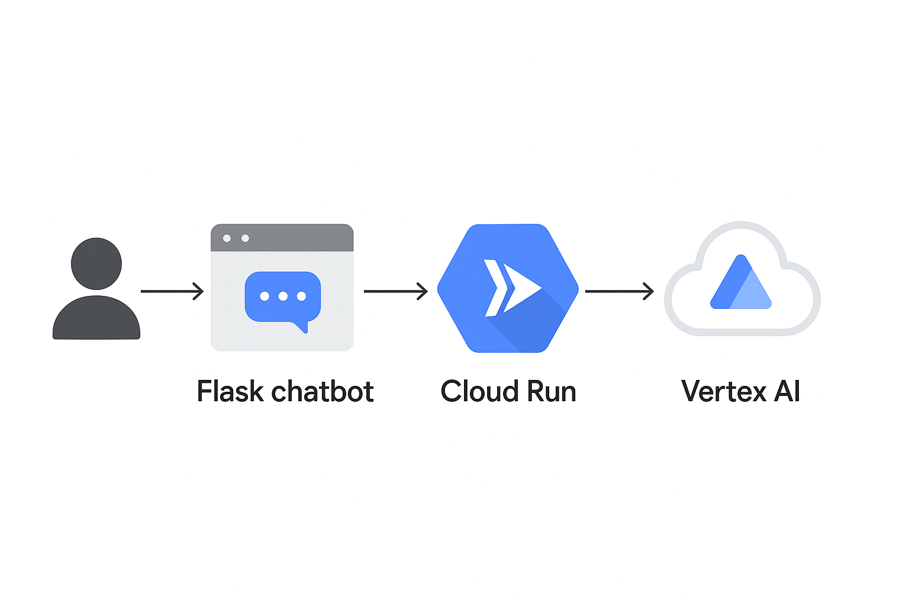
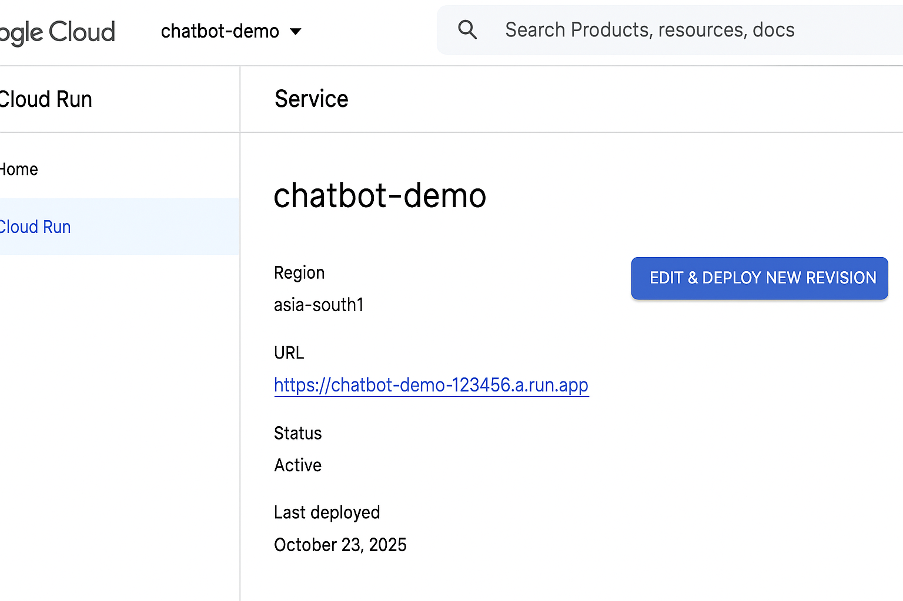

# AI Chatbot on Cloud Run

Built and deployed by **Damayanthi Ravinuthala**

This project is a Flask-based chatbot powered by Google Vertex AI, deployed on Cloud Run.

---

## 🧠 Architecture

The following diagram illustrates how user messages flow through the system:

## 🗒️ Project Description

This project is a conversational AI chatbot powered by Google Cloud’s Vertex AI language models.  
It is built with Flask and containerized using Docker, then deployed on Google Cloud Run for scalable, serverless hosting.  
Users can interact with the chatbot through a simple web interface, and the responses are generated using Vertex AI’s text-generation APIs.

